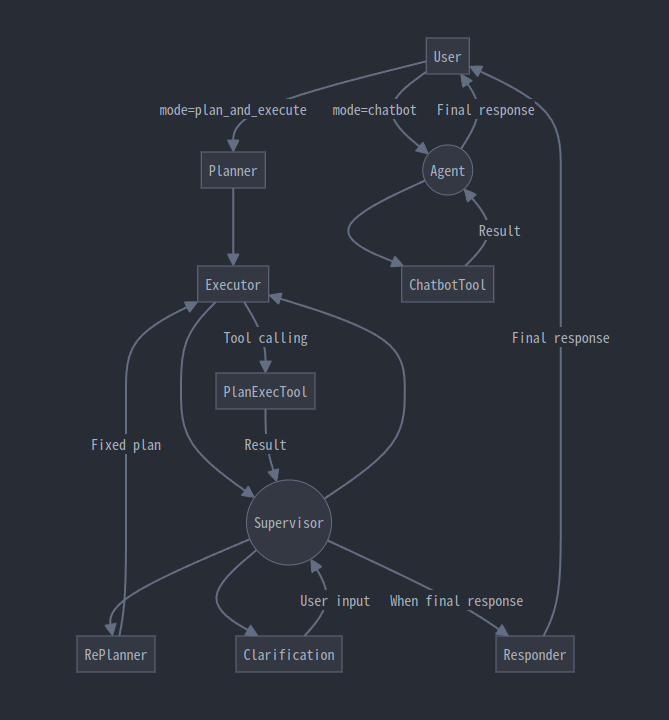
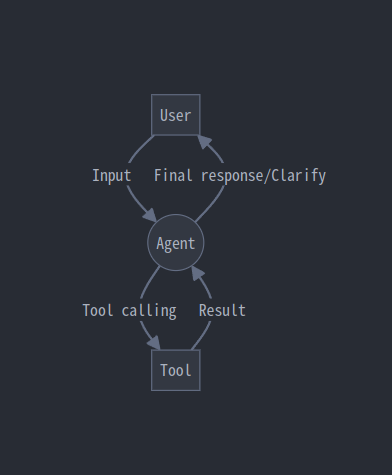
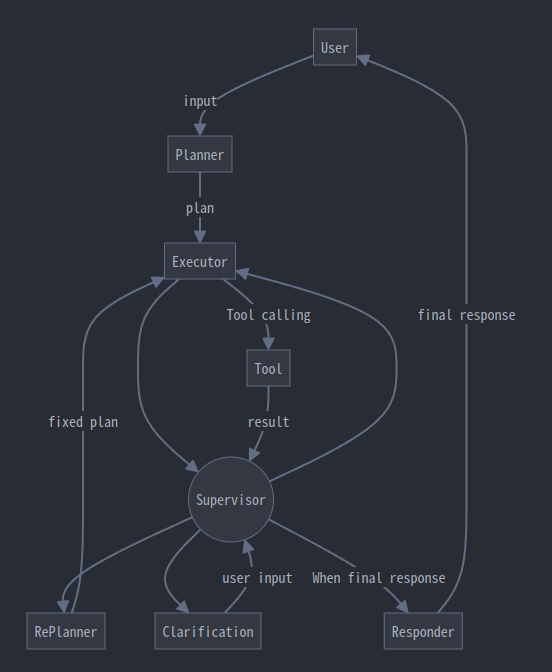

# LangGraphを用いたAgentの開発

情報工学系 人見玲央

---

## 課題設定

- 概要：複数Tool、インタラクティブなAgent作成
- ゴール：該当Agentの作成・評価
- 目的：LLLMの実務活用、LangChainスキル向上

---

## Agentの設計要件

1. ChatBotとして理想的に動作する
    - シンプルな応答・ちょっとした検索はChatGPT風に
2. ロングタスクの実行能力を持つ
    - 必要に応じてユーザーとインタラクティブに

---

## 達成状況

- できたこと
    - LangGraph を用いてAgentを作成する
    - ChatBotベースに、ロングタスク実行能力を与える
    - （ツールを並列利用する）
- 微妙にできたこと
    - ロングタスクで詰まったときに、ユーザーに修正を求める
- できなかったこと
    - **チューニング**
        - 本当に本当に本当に難しい
    - 任意のタイミングでのユーザー割り込み
    - ストリーミング

---

## Agentの設計・実装詳細

- ReAct を ChatBot として使用
- Plan & Execute をロングタスク用として使用
- 入力を見てどちらに割り振るか決定

---

## ReAct (Reasoning and Act)

もともとは Reason とともに Act を選択
$\rightarrow$ Obserbation を取得　の繰り返し

直近LLMはツール呼び出しに最適化されている
$\rightarrow$ LangGraph では tool 呼び出し or 最終出力

---

## Plan and Execute

- Planner: 初期プランを作成
- Executor: ステップ実行 with tools
- RePlanner: プラン修正
- Clarifiaction: ユーザーに確認
- Respond: 最終出力
- Supervisor: Executionの次を決定

**既知の問題：Messagesを持つためPlanを無視しReAct的に動くことがある**

---

## 動作例（成功）

LangSmith のログをブラウザから見ます

- ReAct
    - [ただのChatBotとして動作](https://smith.langchain.com/public/0e39b7be-348c-4ecc-a0fd-ca8d49465516/r)
    - [Web検索](https://smith.langchain.com/public/6cff03cb-c8ad-4942-8b34-5db46610baed/r)
    - [URL参照](https://smith.langchain.com/public/4903899d-d740-482d-816c-2ce25ca9fc4f/r)
    - [Web検索 & URL参照](https://smith.langchain.com/public/9f45f344-e13f-4979-9540-a9087dd86337/r)
- Plan and Execute
    - [すこし複雑なタスク](https://smith.langchain.com/public/bca39079-1f2b-4d83-90ea-75b08d8ea602/r)

---

## 動作例（成功）vs ChatGPT

- [すこし複雑なタスク in ChatGPT](https://chatgpt.com/share/90d48222-0ed1-45a6-96a9-9cbaab0f3d8f)
    - 検索せずにハルシネーションを起こす
    - そもそも命令にそぐわない回答？

---

## 動作例（失敗）

- Plan & Execute
    - [ClarificationでPlan無視](https://smith.langchain.com/public/a2b59c33-5e61-463b-9783-f05c41ede78f/r)

---

## 問題点

- Plan 無視 & RePlanner が呼ばれないことがある
    - 過去ログをほぼすべて保持 $\rightarrow$ ReAct的動作に
    - 情報を絞るとなにもかもまともに動かない

---

## 自己評価：B

### 創造演習プロジェクトとして

- 未完成部分も多いが、基本要件は満たした
- 評価作業は不十分
- スキル向上の目的は達成
    - LangChain & LangGraph のスキルはかなりついた
    - LLM 関連開発の知見もかなり得られた

### ChatBot強化の研究開発として

- 求めていた機能実現はまだまだ難しそう
- Streaming / UI の提供が不可欠
- 知見は十分得られた

---

## 感想

- LLMアプリ開発はとてもつらいです（おすすめしません）
- Agentよりも、LLMに持たせる情報やツールの工夫のほうが効果的です